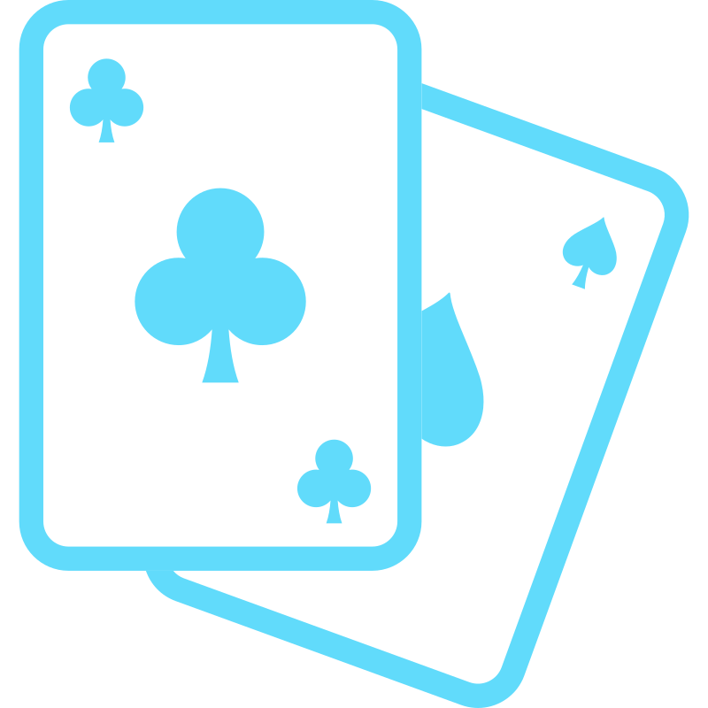

# Matching Pairs memory game

    

Matching Pairs is a memory game where you have to click on a card to see what image is underneath it, and try to find the card with the matching image.

## User Stories
- [x] User can see a grid with n x n cards (n is an integer). All the cards are faced down initially (hidden state).
- [x] User can click a button to start the game. When this button is clicked, a timer will start.
- [x] User can click on any card to unveil the image underneath it (change it to visible state). The image will be displayed until the user clicks on a 2nd card.
<b>When the User clicks on the 2nd card:</b>
- [x] If there is a match, the 2 cards will be eliminated from the game (they stay in the visible state and the figure color changes).
- [x] If there isn't a match, the 2 cards will flip back to their original state (hidden state).
- [ ] When all the matches have been found, the user sees a dialog showing a congratulations message with a counter displaying the time it took to finish the game.

## Bonus features
- [ ] User can choose between multiple levels of difficulty (Easy, Medium, Hard). Increased difficulty means: decreasing the time available to complete and/or increasing the number of cards.
- [ ] User can see the game statistics (number of wins/loses, best time for each difficulty level).

### Project idea
[Github repo: app-ideas](https://github.com/florinpop17/app-ideas)
